# CAN J1939 Toolkit

> A hands-on guide to the **SAE J1939** protocol used across the heavy-duty vehicle industry — covering the core concepts, PGN and SPN structures, how raw CAN data is decoded, and practical data-logging scenarios — together with two standalone Python applications: a **J1939 traffic simulator** and a **J1939 monitor/decoder**. A video reference covering the protocol fundamentals is available [here](https://www.youtube.com/watch?v=vlqxu9ojbHg&t=23s).

---

## Repository Overview

| Application | Description |
|---|---|
| [`simulator/`](simulator/) | A PC-side J1939 frame generator (GTK 3 GUI + headless mode). Emulates the J1939 traffic a real vehicle broadcasts on its CAN bus — 20 PGNs and 30 signals, including standard J1939-71 parameters and proprietary EV signals — driven by a simple vehicle-dynamics model. |
| [`monitor/`](monitor/) | A Linux-side J1939 receiver and live dashboard (GTK 3 GUI + headless mode). Listens on a SocketCAN interface, extracts PGNs from 29-bit identifiers, decodes the signals into physical values and displays them in real time. |

The two applications are designed to work against each other: the simulator plays the role of the vehicle, the monitor plays the role of the on-board receiver. They can be paired over real CAN hardware or, with zero hardware, over a virtual CAN bus.

Each application is fully standalone and ships with its own README covering architecture, installation, usage and extension guides.

---

## System Architecture — the End-to-End Bench

Individually the two apps are useful; together they form a complete **hardware-in-the-loop (HIL) test bench** that recreates a heavy-duty vehicle's CAN network on a desk. The PC plays the **vehicle** — it generates the J1939 traffic — and the tablet plays the **device under test**, the in-vehicle receiver that has to decode it. Between them sits the exact hardware path a real installation uses:

```
  ┌──────────────┐   USB    ┌──────────────────────┐   CAN bus @ 250 kbit/s    ┌────────────────┐
  │ PC GENERATOR │─────────▶│ IXXAT USB-to-CAN II   │──────────────────────────▶│ TABLET MONITOR │
  │  simulator/  │          │  USB  <=>  CAN bridge │   29-bit extended J1939   │   monitor/     │
  └──────────────┘          └──────────────────────┘                           └────────────────┘
   emulates the vehicle       bridges the PC to the                              receives each frame,
   from a dynamics model      physical differential bus                          extracts the PGN, decodes
   (see §7)                   (12 VDC powered)                                    the SPNs, shows values (§8)
```

**1. PC generator — [`simulator/`](simulator/).** A Windows/Linux application that steps a vehicle-dynamics model and packs the resulting signals into protocol-accurate 29-bit J1939 frames — 20 PGNs / 30 signals spanning standard J1939-71 parameters and EV battery/charging groups. On Windows it runs as a single-click executable; see [§7](#7-practical-application-1-the-j1939-simulator).

**2. IXXAT USB-to-CAN II.** An intelligent USB↔CAN adapter that turns the PC's USB port into a real CAN controller. The generator selects it through `python-can`'s `ixxat` backend and transmits at 250 kbit/s onto the bus. Any other `python-can`-supported adapter (Vector, Kvaser, Peak) drops in unchanged.

<p align="center">
  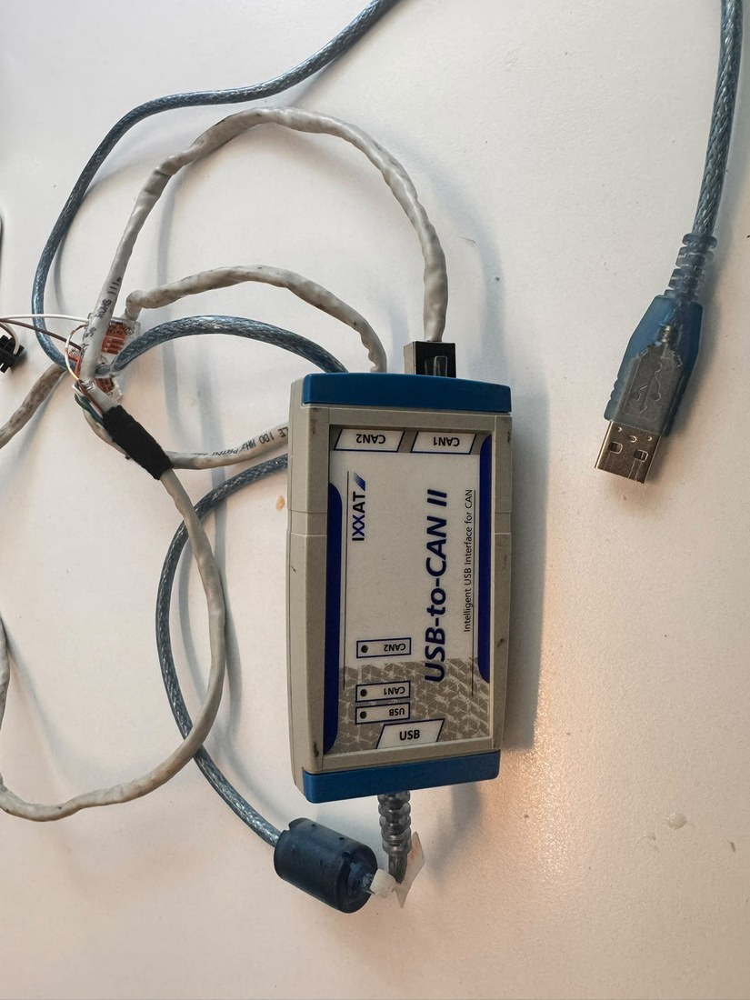
</p>
<p align="center"><i>The IXXAT USB-to-CAN II adapter — the PC's USB port on one side, the vehicle's CAN bus on the other.</i></p>

**3. Physical CAN bus & wiring.** The adapter drives the differential **CAN_H / CAN_L** pair of a 120 Ω-terminated bus. A DB9 breakout and wiring harness route the bus and 12 VDC power out to the vehicle-side connectors (here MCFIT10 / MCFIT6), exactly as on a real loom:

<p align="center">
  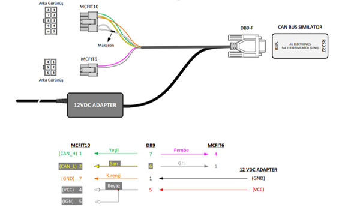
</p>
<p align="center"><i>The bench harness: CAN_H / CAN_L and 12 VDC power broken out from the DB9 bus to the MCFIT vehicle connectors.</i></p>

**4. Tablet monitor — [`monitor/`](monitor/).** An embedded-Linux / tablet application that listens on the bus (SocketCAN), extracts the PGN from every 29-bit identifier, decodes the SPNs into physical values and renders them on a live dashboard — the real receiver under validation. See [§8](#8-practical-application-2-the-j1939-monitor).

> **No hardware on hand? Same pipeline.** Replace the IXXAT link with a virtual or SocketCAN bus and the two apps talk to each other directly — see the [Quick Start in §9](#9-quick-start-pairing-the-two-applications).

---

## Table of Contents

1. [What is J1939?](#1-what-is-j1939)
2. [History and Evolution of J1939](#2-history-and-evolution-of-j1939)
3. [Key Characteristics of the J1939 Standard](#3-key-characteristics-of-the-j1939-standard)
4. [The PGN (Parameter Group Number) Concept](#4-the-pgn-parameter-group-number-concept)
5. [SPN (Suspect Parameter Number) and Data Decoding](#5-spn-suspect-parameter-number-and-data-decoding)
6. [J1939 Data Logging in Practice, DBC Files and Use Cases](#6-j1939-data-logging-in-practice-dbc-files-and-use-cases)
7. [Practical Application 1: The J1939 Simulator](#7-practical-application-1-the-j1939-simulator)
8. [Practical Application 2: The J1939 Monitor](#8-practical-application-2-the-j1939-monitor)
9. [Quick Start: Pairing the Two Applications](#9-quick-start-pairing-the-two-applications)

---

## 1. What is J1939?

In short, **SAE J1939** is a set of standards that defines how the ECUs (Electronic Control Units) in heavy-duty vehicles communicate over a CAN bus.

Most modern vehicles use a **Controller Area Network (CAN)** as the backbone for ECU-to-ECU communication. CAN, however, only provides the communication *infrastructure* (think of it as a telephone line) — it does not define a *language* to speak over that infrastructure. In the vast majority of heavy-duty vehicles, that language is the **SAE J1939** standard, defined by the **Society of Automotive Engineers**.

In more technical terms, J1939 is a **Higher Layer Protocol (HLP)** that uses CAN as its physical layer.

What does this mean in practice? Simply put, J1939 provides a **standardized communication method** across different electronic control units and different manufacturers. Passenger cars, by contrast, use **proprietary protocols** specific to each manufacturer. The concrete consequence: knowing how to read engine speed on an Audi A4 does not help you obtain the same information from a Toyota Camry. On J1939-based heavy-duty vehicles, however, engine speed can be extracted with practically identical decoding rules across the board. This also means J1939 enables a wide range of aftermarket data-logging scenarios, which we cover in later sections.

<p align="center">
  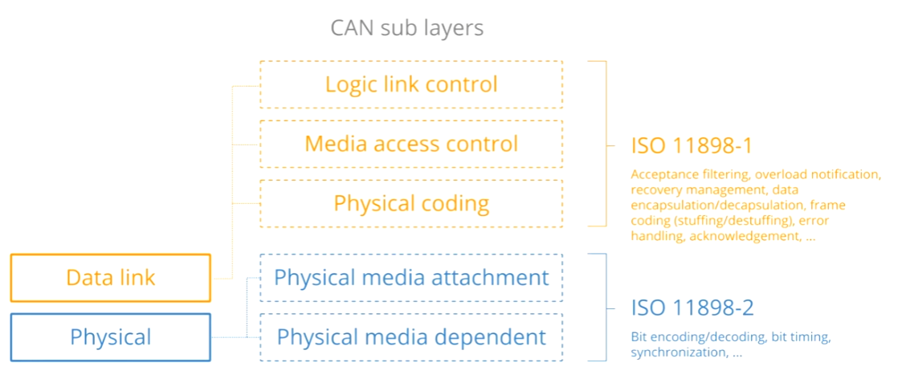
</p>
<p align="center">
  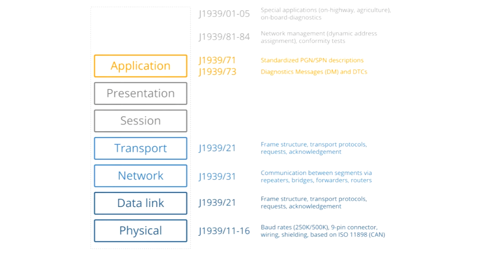
</p>
<p align="center">
  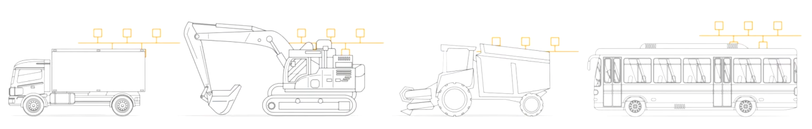
</p>
<p align="center"><i>The layered structure of the CAN bus physical layer and the J1939 higher-layer protocol.</i></p>

<p align="center">
  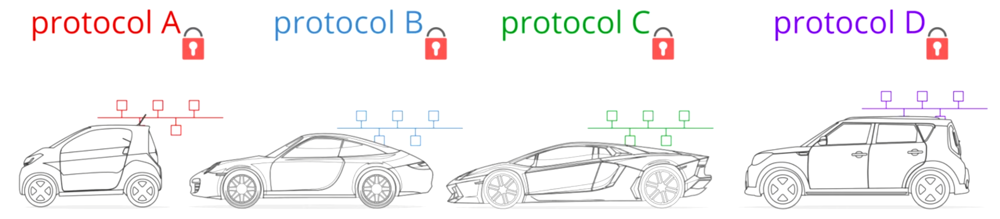
</p>
<p align="center"><i>Visualization of the manufacturer-specific proprietary protocols used in passenger cars.</i></p>

---

## 2. History and Evolution of J1939

A brief look at the historical development of the standard helps put it in context:

- **1994:** The first documents of the standard were published, including **J1939-11**, **J1939-21** and **J1939-31**.
- **2000:** J1939 formally defined the use of CAN bus as its physical layer.
- **2001 and onwards:** J1939 began replacing older standards such as **J1708** and **J1587**.
- **Today:** J1939 is by far the most widely used protocol in heavy-duty vehicles.
- **Recent years:** J1939 has been adapted for **CAN FD** — the next generation of CAN bus — through the **J1939-22** revision.

<p align="center">
  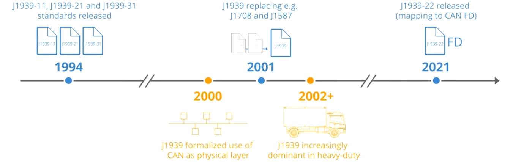
</p>
<p align="center"><i>The evolution of the J1939 standard from 1994 to today.</i></p>

---

## 3. Key Characteristics of the J1939 Standard

Let's walk through the fundamental characteristics of the standard:

### 3.1. Baud Rate

The typical J1939 baud rate is **250 kbit/s**. Newer applications also support **500 kbit/s**.

### 3.2. CAN Identifier Width

The J1939 CAN identifier is always in the **29-bit extended** format, also known as **CAN 2.0B**.

### 3.3. Broadcast Behavior

The majority of J1939 messages are **broadcast** on the CAN bus. Some data, however, can only be obtained on request over the bus.

### 3.4. PGN and SPN Identifiers

J1939 messages are identified by **18-bit Parameter Group Numbers (PGN)**. J1939 signals are called **Suspect Parameter Numbers (SPN)**.

### 3.5. Byte Order and Multi-Byte Data

Multi-byte variables are transmitted **least significant byte first**, i.e. in **Intel byte order (little endian)**. In addition, the **J1939 transport protocol** supports PGNs carrying up to 1785 bytes of data.

<p align="center">
  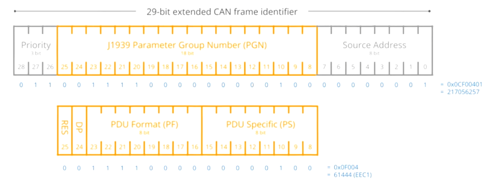
</p>
<p align="center"><i>Summary of the key characteristics of the J1939 standard.</i></p>

---

## 4. The PGN (Parameter Group Number) Concept

Before moving on to the practical logging and decoding side of J1939, we need to look closely at two critical concepts of the standard: **PGN** and **SPN**.

### 4.1. PGN Definition

The J1939 PGN is an **18-bit subset** of the full 29-bit CAN ID. Simply put, the PGN acts as a **unique identifier** for each frame within the J1939 standard. This means that when you want to look up how a J1939 frame is decoded, you look at the **18-bit PGN, not the 29-bit CAN ID**.

### 4.2. Extracting the PGN from a CAN ID (Example)

Let's examine how the PGN is extracted from a CAN ID with a concrete example:

- **29-bit CAN ID of the recorded J1939 message:** `0CF00401`
- The PGN starts at **bit 9** and is **18 bits long** (indexed from 1).
- The extracted PGN is **`F004`** (hex), or **`61444`** in decimal.

<p align="center">
  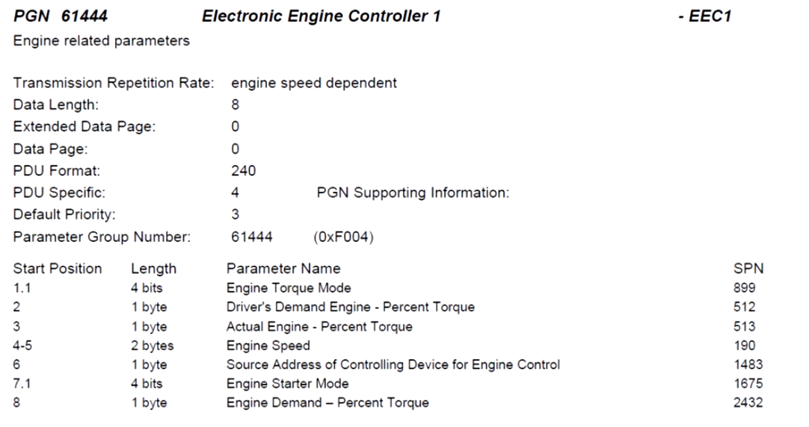
</p>
<p align="center"><i>Bit map showing which bits of the 29-bit CAN ID make up the PGN.</i></p>

### 4.3. What the Example PGN Means: EEC1 (Electronic Engine Controller 1)

Looking up this PGN in the [**J1939-71**](https://yabb.autonerdz.com/yabbfiles/Attachments/j1939-71.pdf) documentation reveals it to be **'Electronic Engine Controller 1'** — **EEC1**. The document also specifies the following details for the PGN:

- Its priority
- Its transmission rate
- The list of associated SPNs

For this example, the PGN carries **seven signals** (i.e. SPNs), one of which is the **Engine Speed** signal. Each of these signals can be looked up in the J1939-71 document for its full definition.

---

## 5. SPN (Suspect Parameter Number) and Data Decoding

### 5.1. SPN Definition

J1939 SPNs are the **identifiers of the CAN signals contained in the data bytes** of each J1939 frame. SPNs are grouped by PGN and are described by the following attributes:

- **Bit start**
- **Bit length**
- **Scale**
- **Offset**

These attributes are required to extract a J1939 parameter from raw data and convert it into a **human-readable (physical) value**.

### 5.2. A Practical Decoding Example: Engine Speed

To see how this works, let's walk through a raw J1939 frame that we assume was previously recorded.

**Step 1:** Extracting the PGN from the CAN ID identifies the message as **PGN 61444**, which we saw in the previous section.

**Step 2:** Using the J1939-71 document, you find that one of the SPNs within this PGN is **Engine Speed (SPN 190)**.

**Step 3:** With the SPN details from J1939-71, you can compute the **physical value** of the Engine Speed signal **in RPM**.

<p align="center">
  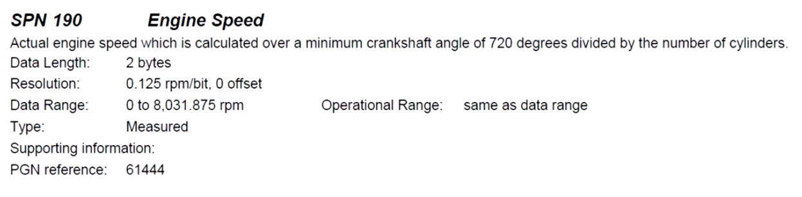
</p>
<p align="center"><i>SPN 190 details of the EEC1 PGN from the J1939-71 document.</i></p>

The relevant parameter values for this example are:

- **Start bit:** 24
- **Bit length:** 16
- Because the Engine Speed signal is **little endian**, the byte sequence must be reordered.
- The byte sequence is `68 13`, which becomes `1368` (hex) after reordering.
- The hex value is converted to decimal and then the **standard linear transformation** used in most CAN decoding is applied.

<p align="center">
  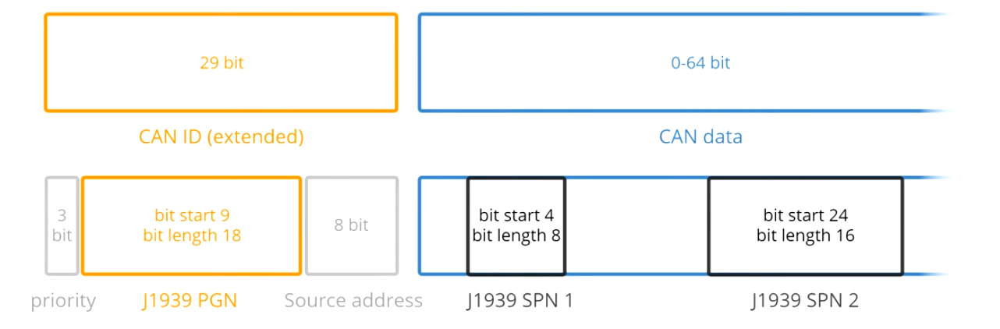
</p>
<p align="center"><i>Flow of the SPN decoding steps: PGN identification, SPN selection, byte reordering, decimal conversion, scale and offset application.</i></p>

<p align="center">
  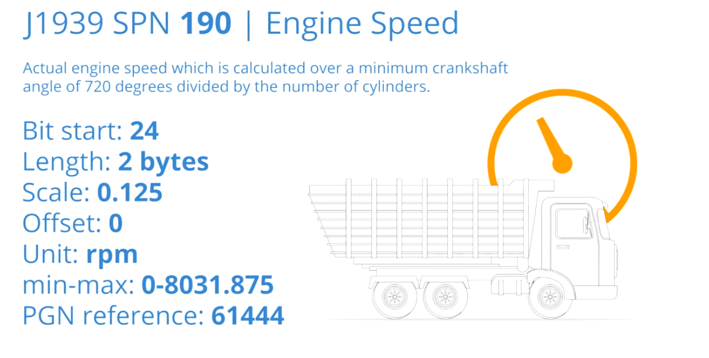
</p>
<p align="center"><i>The raw byte sequence <code>68 13</code> becomes <code>1368</code> after little-endian reordering, yielding a result of 612 RPM.</i></p>

The Engine Speed physical value is therefore calculated as **612 RPM**.

Doing this kind of calculation by hand is naturally quite tedious, so the next section looks at how it is done in practice.

---

## 6. J1939 Data Logging in Practice, DBC Files and Use Cases

### 6.1. Data Logging

In this example, a **CANedge CAN bus data logger** is used to record raw J1939 data from a commercial truck. In most cases, a **J1939 Deutsch connector cable** is used to attach the CAN logger to the vehicle.

Once connected, the logger automatically starts recording all raw CAN frames on the bus into log files on an SD card.

<p align="center">
  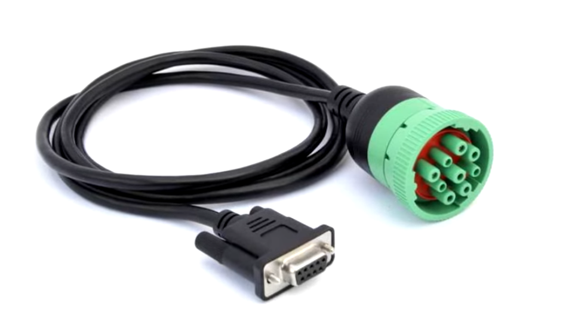
</p>
<p align="center"><i>Connecting the CANedge logger to the vehicle with a J1939 Deutsch connector cable.</i></p>

### 6.2. Inspecting the Raw Data

Removing the SD card and opening one of the log files in the [**asammdf**](https://asammdf.readthedocs.io/en/latest/) software tool reveals the structure of the raw J1939 data. Two elements deserve particular attention:

- **The 29-bit CAN ID values**
- **The data byte contents**

<p align="center">
  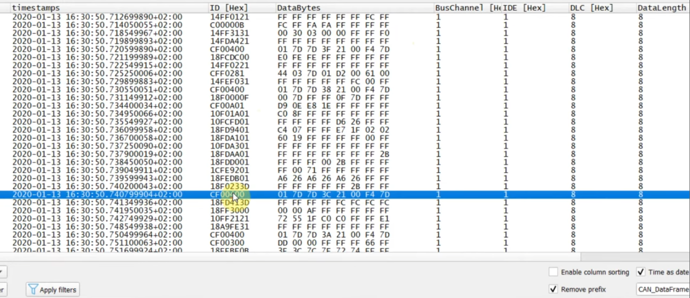
</p>
<p align="center"><i>View of a raw J1939 log file in asammdf; the 29-bit CAN ID and data byte fields stand out.</i></p>

### 6.3. Decoding with DBC Files

Decoding the raw log file relies on a resource called a **CAN database (DBC) file**. DBC is a format that structures CAN bus decoding rules — of the kind used in the earlier examples — in a **standardized form**.

DBC files published specifically for J1939 contain decoding rules for **more than 1800 PGNs** and **more than 12000 SPNs**.

Most CAN bus software tools today, including **asammdf**, support DBC files. This makes it straightforward to decode the raw truck log file using a J1939 DBC file. The result is a new file containing the **physical values** of every SPN matched by the DBC file.

For a particular truck, this decoding yields **more than 250 unique parameters**, including:

- Engine speed
- Wheel speed
- Fuel rates
- GPS positions
- Oil temperatures
- And many more

These parameter time series can be analyzed and visualized with **asammdf**, custom scripts or **dashboard** tools.

<p align="center">
  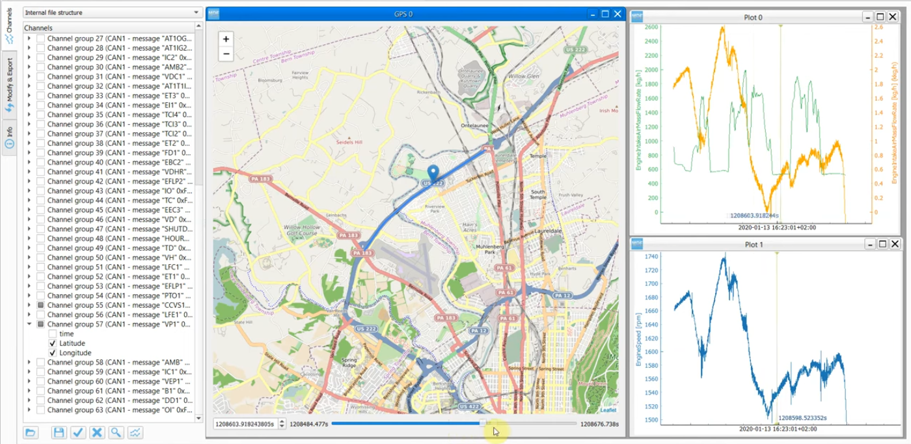
</p>
<p align="center"><i>The flow between the raw log file, the DBC file and the decoded physical-value output.</i></p>

### 6.4. Use Cases

In practice, J1939 data is recorded for a wide variety of use cases.

#### 6.4.1. Fleet Management

J1939 data collected from trucks, buses, tractors and similar heavy-duty vehicles can be used in **fleet management** to reduce costs and improve safety.

<p align="center">
  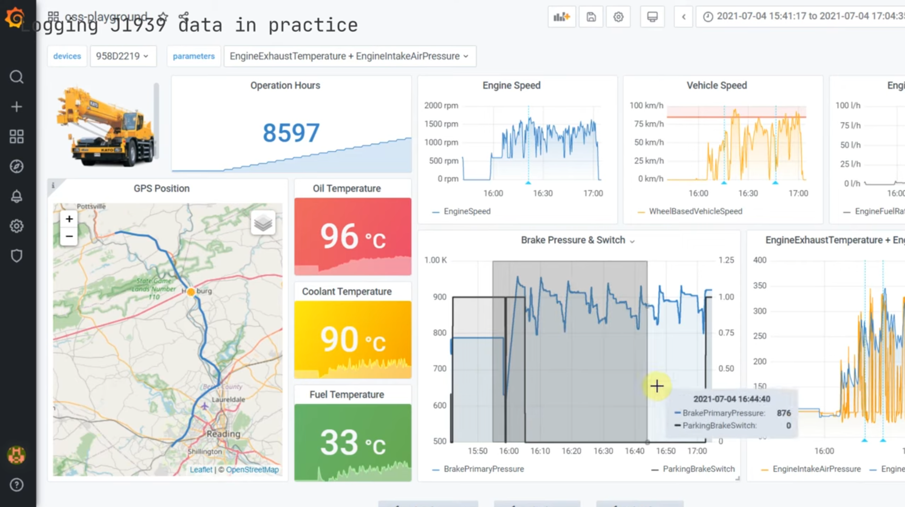
</p>
<p align="center"><i>An example dashboard visualizing J1939 data on a fleet management platform.</i></p>

#### 6.4.2. Real-Time Diagnostics

Raw or decoded J1939 data can be **streamed** to a PC over USB to diagnose vehicle issues in real time.

#### 6.4.3. Predictive Maintenance

Another application of J1939 data is **predictive maintenance**. In this scenario, IoT devices record J1939 data and **diagnostic trouble codes** to anticipate potential problems and minimize downtime.

<p align="center">
  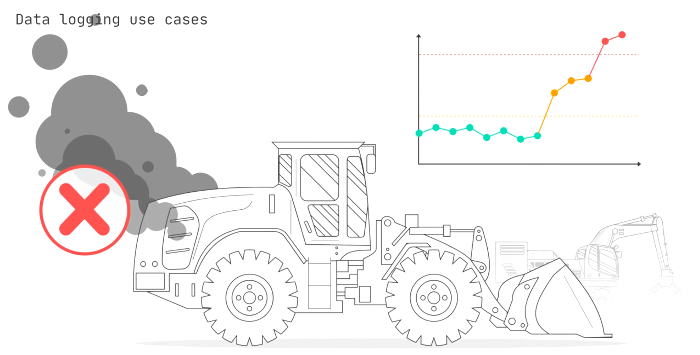
</p>
<p align="center"><i>A predictive-maintenance architecture in which IoT devices push J1939 data and DTC information to the cloud.</i></p>

#### 6.4.4. Blackbox Applications

With the spread of low-cost J1939 data loggers, heavy-duty vehicle manufacturers increasingly equip their vehicles with **blackbox** systems. Thanks to **historical data recording**, these systems help diagnose intermittent issues and resolve **warranty disputes**.

<p align="center">
  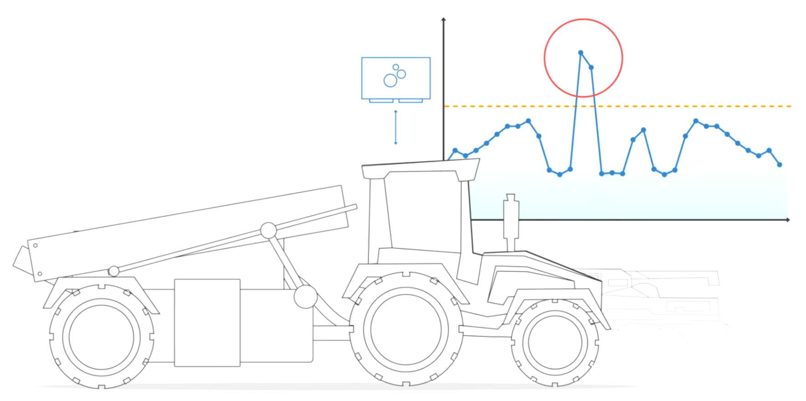
</p>
<p align="center"><i>A blackbox device installed on a truck and its historical data-recording flow.</i></p>

---

## 7. Practical Application 1: The J1939 Simulator

To put the theory above into practice, this repository includes a **PC-side J1939 simulator**. Its purpose is to faithfully emulate the J1939 frames a real vehicle broadcasts on its CAN bus, making it possible to validate receiver devices (on-board units, telematics gateways, dashboards, data loggers) before going into the field.

The simulator can transmit at 250 kbit/s or 500 kbit/s through a USB-to-CAN adapter (e.g. Ixxat USB-to-CAN II) or any other hardware supported by `python-can`. Since it also works with a virtual CAN interface when no hardware is present, it is equally suitable for CI/CD pipelines.

On Windows it also ships as a **single-click executable** — no Python, GTK or CAN drivers required. It defaults to a hardware-free virtual CAN bus, so you can double-click it, press **START SIMULATION**, and immediately watch the vehicle's J1939 traffic being generated:

<p align="center">
  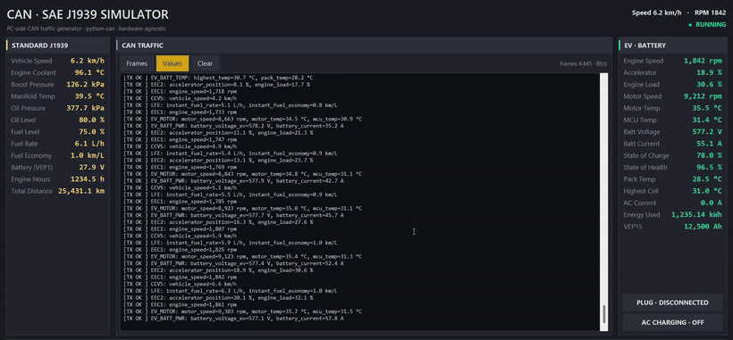
</p>
<p align="center"><i>The generator running live — the vehicle-dynamics model drives 20 PGNs on their own broadcast periods, shown here in decoded "Values" mode.</i></p>

<p align="center">
  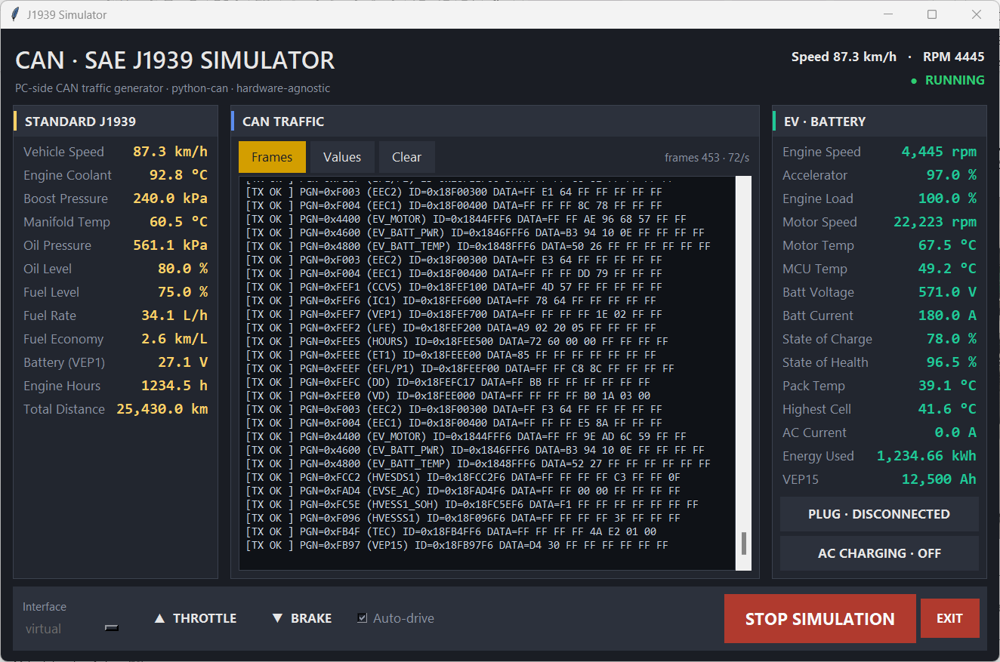
</p>
<p align="center"><i>The simulator broadcasting 20 PGNs as raw 29-bit J1939 frames over the virtual bus, driven by a live vehicle-dynamics model.</i></p>

<p align="center">
  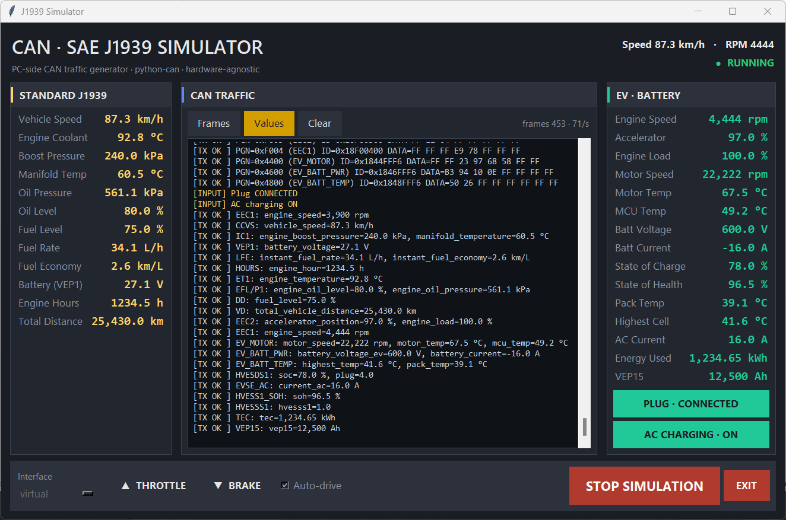
</p>
<p align="center"><i>The same traffic decoded into physical values, with the EV battery pack charging (plug connected, AC charging on).</i></p>

### 7.1. Architecture at a Glance

The application consists of five main layers:

- **Protocol layer:** SAE J1939-21 compliant 29-bit extended CAN ID composition, PDU1/PDU2 handling, signal encoding (scale, offset, bit start/length, range clamping).
- **Signal database:** A `dataclass`-based single source of truth for all broadcast PGN and SPN definitions.
- **Transport layer:** A hardware-agnostic facade over `python-can` (Ixxat, Vector, Kvaser, Peak, SocketCAN, virtual).
- **Vehicle dynamics model:** A simple vehicle model that responds smoothly to throttle, brake and charging inputs.
- **Broadcast scheduler:** An engine that manages the per-PGN broadcast period and feeds the UI through BroadcastEvent listeners.

A GTK 3 graphical interface drives all of these components from a control panel, offering a real-time signal dashboard and a log panel.

### 7.2. Documentation

See the simulator's own README for installation, configuration, usage, testing and extension guides:

- [`simulator/README.md`](simulator/README.md)

## 8. Practical Application 2: The J1939 Monitor

The second application is the consumer side of the protocol: a **Linux J1939 monitor** designed for embedded Linux devices (on-board computers, in-vehicle tablets, industrial gateways) that receive J1939 traffic over SocketCAN.

It listens on a CAN interface with an event-driven `python-can` notifier, extracts the PGN from each 29-bit extended identifier using proper PDU1/PDU2 logic, decodes the payload through a declarative signal table (17 PGNs covering standard J1939-71 parameters and EV battery/charging signals) and renders the physical values on a GTK 3 dashboard — or on the console in headless mode.

<p align="center">
  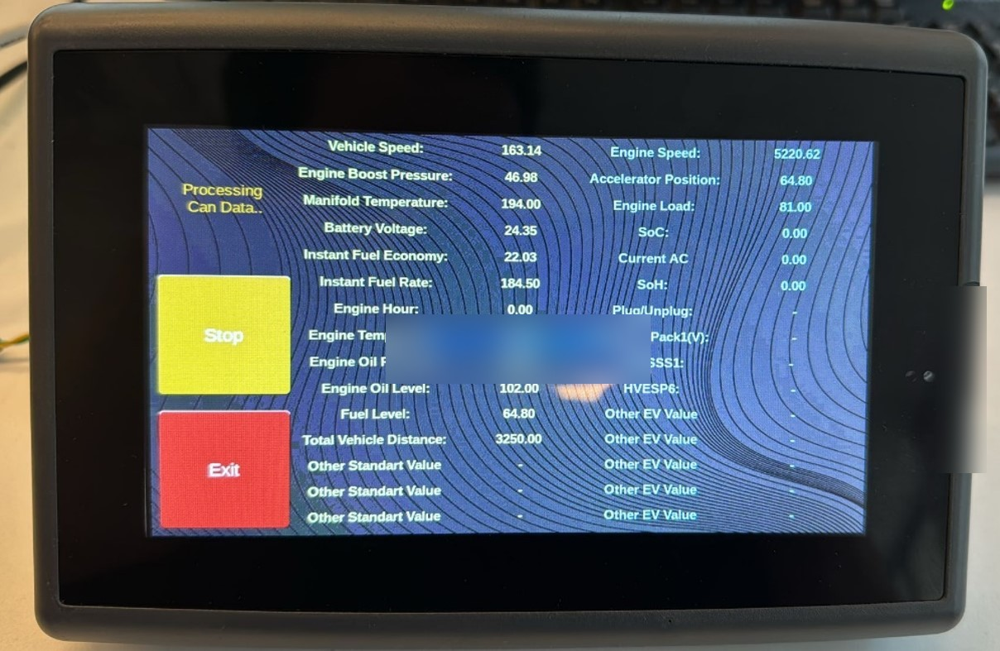
</p>
<p align="center"><i>The monitor deployed on an in-vehicle tablet — the device-under-test decoding the generator's J1939 traffic into live physical values.</i></p>

### 8.1. Documentation

See the monitor's own README for prerequisites, installation, usage and extension guides:

- [`monitor/README.md`](monitor/README.md)

---

## 9. Quick Start: Pairing the Two Applications

The fastest way to see the full pipeline in action — with no CAN hardware at all — is a virtual SocketCAN device on Linux, shared system-wide between the two processes:

```bash
cd simulator && pip install -r requirements.txt && cd ..
cd monitor && pip install -r requirements.txt && cd ..

sudo modprobe vcan
sudo ip link add dev vcan0 type vcan
sudo ip link set up vcan0

python simulator/main.py --headless --interface socketcan --channel vcan0 &
python monitor/main.py --headless --interface socketcan --channel vcan0
```

The simulator starts broadcasting J1939 frames from its vehicle model, and the monitor decodes them into physical values in real time.

Without kernel modules (e.g. inside a container), python-can's `udp_multicast` interface links the two processes over the loopback network instead (Linux/macOS, requires `pip install msgpack`):

```bash
python simulator/main.py --headless --interface udp_multicast --channel 239.74.163.2 &
python monitor/main.py --headless --interface udp_multicast --channel 239.74.163.2
```

Note that python-can's `virtual` interface is process-local: it is ideal for unit tests and single-process soak runs, but it cannot bridge two separate processes.

---

## Closing Notes

This document covered what the **SAE J1939** standard is, how it evolved into its current position, its key characteristics, what the **PGN** and **SPN** concepts mean, and how a raw CAN frame is converted into a physical value. It also summarized how J1939 data is logged in practice, how it is decoded with **DBC files**, and the industry use cases it serves. Finally, it introduced the two companion applications in this repository: the **J1939 simulator** that produces protocol-accurate traffic, and the **J1939 monitor** that consumes and decodes it.

This is an educational project. The SAE J1939 specification documents are not redistributed here; refer to [SAE International](https://www.sae.org/) for the official standards.
